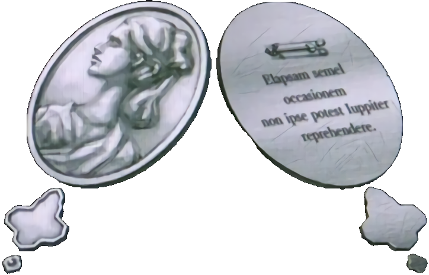

  # Hello, I'm Luís Augusto Lima de Oliveira
  
  ### Computer Science Student
  
  

    <em>"Elapsam semel occasionem non ipse potest Iuppiter reprehendere"</em> 
    <strong>"Not even Jupiter can find a lost opportunity."</strong> 
    - Zero Escape Series
  

  

---

## About Me

I'm a 5th semester Computer Science student at PUC Minas with a passion for problem-solving and technology. My academic journey has given me a solid foundation in algorithms, data structures, and object-oriented programming, with hands-on experience in C, C++, Java, and hardware integration using Arduino. I'm naturally studious and committed to continuous learning in the ever-evolving tech landscape.

**Current Focus:** Software development, data analysis, and hardware integration projects.

<!-- 

  <b>When not coding</b>: I enjoy playing games, primarly plataformers and arcade racing games. Sometimes visual novels like Zero Escape.

 -->

---

## 📊 GitHub Statistics

  
  <picture>
    <source media="(prefers-color-scheme: dark)" srcset="https://github-readme-stats.vercel.app/api?username=LuisAugusto0&show_icons=true&count_private=true&hide_border=true&title_color=6497b1&icon_color=6497b1&text_color=b3cde0&theme=transparent">
    
  </picture>
  <picture>
    <source media="(prefers-color-scheme: dark)" srcset="https://github-readme-stats.vercel.app/api/top-langs/?username=LuisAugusto0&layout=compact&hide_border=true&title_color=6497b1&text_color=b3cde0&theme=transparent&hide=jupyter%20notebook,shaderlab,Dart">
    
  </picture>

  <picture>
    <source media="(prefers-color-scheme: dark)" srcset="https://github-readme-streak-stats.herokuapp.com/?user=LuisAugusto0&theme=transparent&border=6497b1&stroke=6497b1&ring=6497b1&fire=005b96&currStreakNum=b3cde0&sideNums=b3cde0&currStreakLabel=6497b1&sideLabels=6497b1&dates=b3cde0&hide_border=true">
    
  </picture>

---

## Tech Stack

### 💻 Programming Languages
&nbsp;
&nbsp;
&nbsp;
&nbsp;
&nbsp;

### 🌐 Web Technologies
&nbsp;
&nbsp;
&nbsp;

### 🔧 Frameworks & Tools
&nbsp;
&nbsp;
&nbsp;
&nbsp;

---

## Current Projects

- **HeatSync**: Java application for refining a refrigeration notebook database
- **Automation Scripts**: Personal Windows batch script automations  
- **Data Analysis**: Python database filtering for FCA method analysis using Lattice Miner

---

## Contact

&nbsp;
&nbsp;

---

  Last manually updated: <i>04/07/2025</i>

